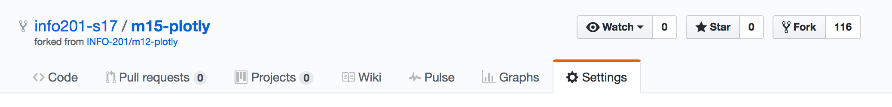
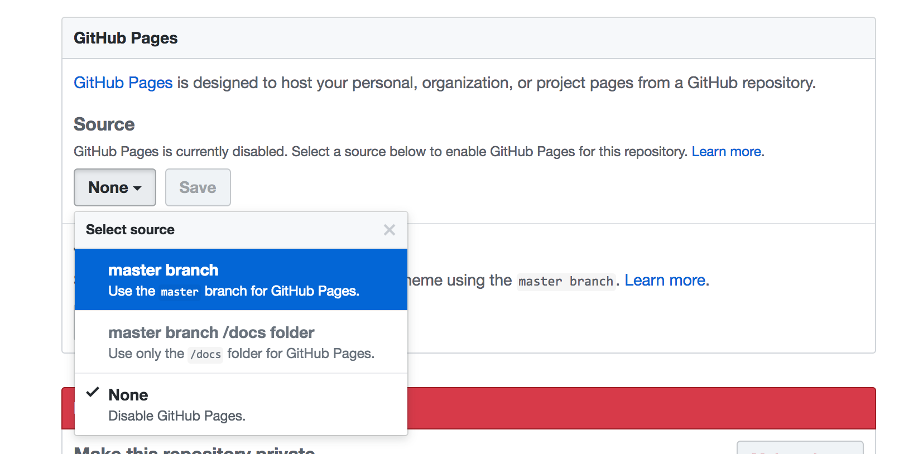

# Exercise-1
In this exercise, you'll practice using the [Plotly API](https://plot.ly/r/) to build an interactive map in an RMardown file, then compiling it to an `index.html` file and getting it hosted as a website on GitHub.

Follow these steps to complete the exercise:

- As in previous exercises, you should **fork** and **clone** this repository.
- Create an new R Markdown (`.Rmd`) file in this project called `index.Rmd` (so that we can easily create a website)
- Using the available documentation, create an [choropleth map](https://plot.ly/r/choropleth-maps/) using Plotly (in a **code block**)
- Write a short paragraph, and then show your plot in your Markdown file
- Knit your HTML file
- Add and commit your changes to Git (on your terminal)
- Push your changes back up to GitHub
- **On GitHub**, navigate to your **Settings** Tab:

- Scroll down to the **GitHub Pages** section, and select your **master branch** to be the hosted website

- View your new interactive website at `YOUR-USERNAME.github.io/m15-plotly/exercise-1`
